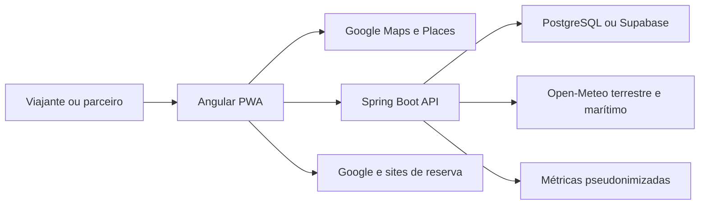

# Arquitetura do SisTur

## Visão geral

## Frontend

- Rotas de negócio são carregadas sob demanda; mapa, roteiro e dashboards não entram no bundle inicial.
- Signals e `OnPush` são usados nas telas de maior volume.
- `runtime-config.js` injeta URL da API, chave do mapa e canais comerciais no deploy sem recompilar o código fonte.
- O service worker armazena apenas shell e arquivos estáticos. Preços, clima e respostas da API não são congelados.
- O roteiro em `localStorage` continua acessível offline; sincronização em nuvem exige autenticação e conexão.
- Orçamento, despesas e códigos de reserva ficam em um workspace local separado e não são enviados ao roteiro público.
- O exportador `.ics` reúne apenas paradas agendadas e reservas inseridas pelo usuário, sem depender de acesso ao Google Calendar.
- Google Maps é a camada preferencial quando configurada. Leaflet funciona como fallback operacional.
- O carregamento inicial do Google possui orçamento de 1,2 segundo; conexões lentas recebem o mapa satélite Leaflet sem esperar o timeout completo do provedor.

## Backend

- Controllers recebem DTOs validados e nunca aceitam entidades JPA diretamente nos fluxos revisados.
- Services concentram autorização de propriedade, regras de publicação e transações.
- Repositories usam paginação, consultas agregadas e índices para feed e analytics.
- Respostas de erro possuem `code`, `requestId` e mensagem segura.
- Perfis, comentários e roteiros públicos retornam DTOs sem e-mail ou senha.
- IP de analytics é transformado em identificador pseudônimo com sal antes da persistência.
- Endpoints públicos sensíveis possuem limite de taxa por instância; o proxy/WAF deve complementar o controle quando houver mais de uma réplica.
- GitHub Actions executa testes e builds; Dependabot acompanha Maven e npm semanalmente.

## Integrações

- Google Maps JavaScript API e Places: mapa detalhado, rotas, fotos, avaliações e horários.
- Open-Meteo: previsão terrestre e marítima com cache no backend.
- Links Google e parceiros: saída para compra ou reserva com evento de clique.
- Supabase: PostgreSQL gerenciado. O backend usa sua própria autenticação JWT neste momento.

## Decisões importantes

1. Clique externo não equivale a venda confirmada. Compra concluída precisa de affiliate ID, webhook, callback do parceiro ou conciliação.
2. Dados oficiais e comerciais possuem datas de verificação e devem seguir uma rotina editorial.
3. Swagger fica desligado por padrão em produção e pode ser ativado por ambiente.
4. JDK 21 é obrigatório. JDK 26 não é suportado pelo pipeline atual de anotação.
5. A linha Spring Boot 3.4 permanece suportada, mas deve ser mantida no patch mais recente e migrada de linha em ciclo próprio: [política oficial](https://github.com/spring-projects/spring-boot/wiki/Supported-Versions).
6. Maven 3.9.9 e JDK 21 são fixados por wrapper, CI, Docker e Maven Enforcer para produzir builds reproduzíveis.
7. Dados privados de viagem só poderão ser sincronizados quando houver autorização por participante, criptografia em trânsito e repouso, revogação e exclusão auditável.

## Dívida técnica controlada

- A migração inicial ainda depende de `hibernate.ddl-auto=update` para banco vazio. Antes de escalar produção, gerar uma baseline SQL completa e usar `JPA_DDL_AUTO=validate`.
- JWT fica em `localStorage`. Para operação de maior risco, avaliar BFF com cookie `HttpOnly`, `Secure` e proteção CSRF.
- O mapa é uma tela extensa. Próxima refatoração deve separar adaptadores Google/Leaflet, camada de dados e apresentação sem alterar comportamento.
- Cache local em memória é adequado a uma instância. Escala horizontal exige cache compartilhado e invalidação coordenada.
- O namespace Java atual é `br.gov.noronha`. Se o operador não for um órgão público autorizado, ele deve ser renomeado para o domínio real da empresa antes da distribuição comercial.
- Páginas públicas ainda são uma SPA. Aquisição orgânica e previews completos exigem prerender/SSR, sitemap e metadados dinâmicos por perfil.
